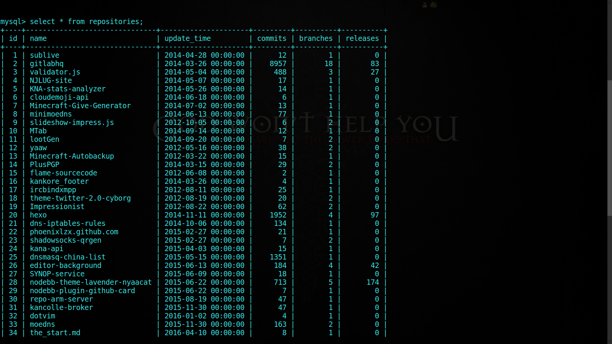

# github_spider

## 应用简介

使用 scrapy 爬虫框架，爬取任意指定用户的所有仓库名称及仓库的提交、分支、版本。

## 启动应用

基于 Python3 开发，通过 virtualenv 建立开发环境
```bash
$ virtualenv venv
$ source venv/bin/activate
$ pip install -r requirements.txt
```
依赖软件包安装完成后，创建数据库和表：
```bash
mysql> create database github;
$ python3 github_spider/models.py
```
接着使用 `scrapy crawl repositories` 来启动爬虫。

## 应用演示

由于自己的仓库数较少，这里爬取了 [Phoenix Nemo](https://github.com/phoenixlzx) 的数据作为演示。

爬取到的数据的截图：

